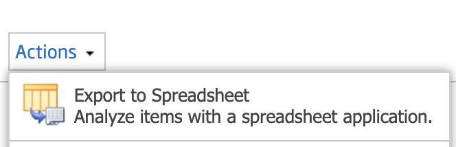

# Sharepoint Download Documents with NodeJS

Download query.iqy file from Sharepoint web interface and save to project folder



Edit index.js file for login

```
const client = NtlmClient({
  username: "", // SharePoint username
  password: "", // SharePoint password
  domain: "", // Domain
});
```

edit for RootFolder

```
const baseUrl = owssvrUrl.origin + "/Documents";
```

Start download

```
node index.js
```
